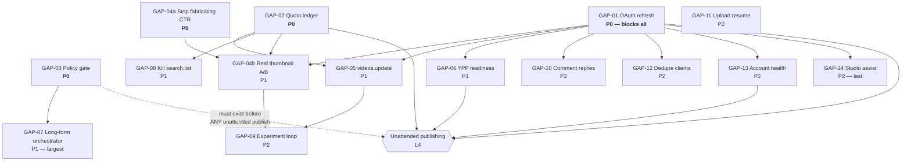

# 03 — GAPS + DEPENDENCY GRAPH

Ranked by **impact on autonomy**, not by ease. GAP-01 is first because until it is closed every
other item on this list is decoration.

---

## GAP-01 — No OAuth refresh: all YouTube writes die after ~1 hour  **[P0, blocks everything]**

**Why it matters.** `src/core/tools/builtin/social/youtube-tools.ts:45` and `:144` read
`process.env['YOUTUBE_OAUTH_TOKEN']` as a static access token. Google access tokens expire in ~1
hour. There is no `refresh_token` handling anywhere on the YouTube surface (grep: zero hits).
Consequence: **a human must paste a fresh token before every single operation.** Unattended
operation is not degraded, it is impossible. This one line caps the whole system at L2.

**Architectural approach.** Build a small YouTube-scoped OAuth module mirroring the *already
correct* pattern in `src/core/gdrive/auth.ts:59 createOAuthClient()`: client id/secret from a
file-or-env secret ref, refresh token persisted at `0600`, rotated tokens written back on the
googleapis `client.on('tokens', …)` event (`gdrive/auth.ts:72-81`), plus a one-time loopback
consent flow for the human handoff in Gate 3 step 5.

Do **not** import `core/gdrive` to do it. `CLAUDE.md` invariant 3 forbids `src/core/gdrive` imports
from hot-path modules, and coupling YouTube publishing to the Drive subsystem is wrong on
separation grounds regardless. Copy the pattern, not the module.

**Components to build.**
- `src/core/youtube/auth.ts` — `getYouTubeAccessToken()`: returns a valid access token, refreshing
  and persisting transparently. Env: `YOUTUBE_OAUTH_CLIENT_ID`, `YOUTUBE_OAUTH_CLIENT_SECRET`,
  `YOUTUBE_OAUTH_REFRESH_TOKEN`, `YOUTUBE_TOKEN_FILE`.
- Backward compatibility: if only `YOUTUBE_OAUTH_TOKEN` is set, keep using it (so nothing breaks),
  but log that it is non-renewable.

**Wiring.** Replace the three static reads: `youtube-tools.ts:45`, `youtube-tools.ts:144`,
`src/core/youtube/comment-engine.ts:198`. Also `src/core/earning/tracker.ts` `getAccessToken()`.

**Complexity:** Low (a day). **Risk:** Low. **Depends on:** nothing. **Unblocks:** everything.

---

## GAP-02 — No quota accounting; one function can eat the entire daily budget  **[P0]**

**Why it matters.** Gate 1: 10,000 units/day, `videos.insert` = 1,600, `search.list` = 100.
`src/core/feedback/youtube-api.ts:75` calls `/search` **inside a `pageToken` pagination loop** — 100
iterations exhausts the day and silently starves publishing. Nothing in the repo counts units.
Without a ledger, quota exhaustion presents as random 403s at 3am with no diagnosis.

**Approach.** A unit-cost ledger in front of every Data API call. Per-call cost table, a
persisted daily counter (SQLite, resetting midnight Pacific — *not* midnight local), a reservation
API so the upload lane can hold its 1,600 units, and a hard refusal when the budget is spent.
`search.list` gets a **deny-by-default guard** with an explicit override flag, per Gate 1.

**Components.** `src/core/youtube/quota-ledger.ts` — `QUOTA_COSTS`, `reserve()`, `record()`,
`remaining()`, `canAfford()`. Wrap the fetch sites.

**Wiring.** `youtube-tools.ts:63`, `:177`; `comment-api.ts:16`; `thumbnail-ab.ts:263`;
`feedback/youtube-api.ts:75,93`; `daemon/event-detectors.ts:65,208`.

**Complexity:** Low-Medium. **Risk:** Low. **Depends on:** nothing. **Unblocks:** GAP-05, GAP-08.

---

## GAP-03 — No pre-publish policy gate; channel-level enforcement makes this safety-critical  **[P0]**

**Why it matters.** Gate 4: enforcement reviews the **channel as a whole**. One batch of templated
output retroactively endangers every video already published. The repo can publish 6×/day
(`social.youtube-upload`) with **zero** policy checks. It can destroy the asset faster than it
builds it. There is also no synthetic-media disclosure anywhere —
`selfDeclaredMadeForKids` (`youtube-tools.ts:60`) is the COPPA flag, not the AI-disclosure flag.

**Approach.** A blocking gate that every publish path must pass. Two independent checks:
1. **Cross-video similarity** — compare the candidate script against the last N published scripts.
   The repo already has local embeddings (memory: `project-local-embeddings`, `sqlite-vec` is a
   dependency). High similarity ⇒ "templated" ⇒ **block**.
2. **Structural-variation + policy rubric** — an LLM judge against the actual Gate 4 criteria
   (template with little variation, replicable at scale, slideshow without substance), returning a
   verdict plus reasons.

Fail **closed**: unknown ⇒ block. Per `CLAUDE.md` invariant 7, the judge route must be independent
of the route that wrote the script.

**Components.** `src/core/youtube/policy-gate.ts` — `assessPublishCandidate()` returning
`{ verdict: 'pass'|'block'|'hold', reasons[], similarityScore }`.

**Wiring.** Called by the publish orchestrator before `social.youtube-upload`; gate must be
un-bypassable from the agent loop.

**Complexity:** Medium. **Risk:** Medium (false blocks are annoying; false passes are fatal — tune
toward false blocks). **Depends on:** nothing hard. **Unblocks:** any unattended publishing.

---

## GAP-04 — Thumbnail A/B fabricates its own measurements  **[P0 — disable; P1 — rebuild]**

**Why it matters.** `src/core/youtube/thumbnail-ab.ts:296` writes a hardcoded `0.04` CTR for every
variant, so `selectWinner()` (`:171`) compares identical numbers and the DB records a
tie-break as a measured result. Downstream consumers cannot distinguish this from real data. A
system that reports fabricated experiment results is worse than one with no experiments — it will
be *believed*, and it will steer content strategy with noise.

Compounding: **there is no `thumbnails.set` call anywhere in `src/`** (grep: zero hits), so the
variant being "tested" is never actually deployed.

**Approach.** Two stages.
- *Immediately (P0):* make it refuse rather than fabricate. Return `null`/`unmeasured` and leave
  `measured_ctr` NULL when no Analytics data is available. Cheap, and stops the bleeding.
- *Then (P1):* real implementation — `thumbnails.set` (Data API, 50 units) to deploy, and
  Analytics API `impressions` + `impressionClickThroughRate` to measure. The OAuth plumbing for
  this already exists at `youtube-tools.ts:177`; only the metric names change.

**Complexity:** Low (disable) / Medium (rebuild). **Depends on:** GAP-01 (Analytics needs live auth).

---

## GAP-05 — No `videos.update`: metadata is write-once  **[P1]**

**Why it matters.** Metadata is set only at upload (`youtube-tools.ts:58-61`). There is no
`videos.update` call in `src/`. Title iteration is among the highest-leverage YouTube
optimisations and it is **structurally unavailable**. Also `title.slice(0,100)` (`:59`) silently
mangles long titles instead of rejecting them.

**Approach.** `social.youtube-update-metadata` tool. `videos.update` costs 50 units — cheap, so it
becomes the primary experimentation actuator (title A/B is far easier than thumbnail A/B and needs
no Studio automation). Must read-modify-write the full `snippet` — a partial `videos.update`
**erases** omitted fields, which is an easy way to blank every description on a channel.

**Complexity:** Low. **Depends on:** GAP-01, GAP-02. **Unblocks:** GAP-09.

---

## GAP-06 — No monetization-readiness model  **[P1]**

Nothing tracks progress toward 1,000 subs / 4,000 watch-hours / 10M Shorts views, strike status, or
2SV. All inputs are already available from the working analytics tool (`youtube-tools.ts:127`).
Build `src/core/youtube/ypp-readiness.ts` computing distance-to-threshold plus a projected
eligibility date, and alert when the human needs to click Apply (Gate 3 step 7).
**Complexity:** Low. **Depends on:** GAP-01.

---

## GAP-07 — No long-form production orchestrator; Remotion is unwired  **[P1]**

`media.shorts-factory` produces static-image-plus-VO — the exact Gate 4 demonetisation profile.
`src/remotion/` has real compositions and `@remotion/renderer` is a real dependency, but **nothing
in `src/**` imports Remotion to render**. Meanwhile real ffmpeg primitives exist
(`video-tools.ts:50` → `superpowers/ffmpeg-tools.ts`).

The missing piece is a **scene-graph → timeline → render** orchestrator: a script decomposed into
beats, each beat bound to a visual (generated, stock, or b-roll from `media.video-generate`),
narration time-aligned, captions burned, assembled. Either wire the existing Remotion renderer or
build the ffmpeg concat pipeline. **Wire Remotion** — it is already paid for.

**Complexity:** High. This is the largest single item and the one most likely to consume a whole
run on its own. **Depends on:** GAP-03 (no point producing what the gate will block).

---

## GAP-08 — Competitor intel burns quota via `search.list`  **[P1]**

`feedback/youtube-api.ts:75` paginates `/search` at 100 units/call. Replace with the **zero-quota
RSS feed** (`youtube.com/feeds/videos.xml?channel_id=…`) or `playlistItems.list` on the uploads
playlist (1 unit). Pure win: cheaper, faster, no quota risk.
**Complexity:** Low. **Depends on:** GAP-02.

---

## GAP-09 — No experiment registry / optimisation loop  **[P2]**

Data is collected (`earning/tracker.ts:104`) but nothing reads outcomes and changes future
decisions. With GAP-05 done, title A/B becomes the cheap actuator. Needs an experiment registry
with real significance testing — not the tie-break in GAP-04.
**Depends on:** GAP-04, GAP-05.

---

## GAP-10 — Comment replies unreachable  **[P2]**
`postReply` (`comment-engine.ts:194`) stubs out without a token (`:203`); `postCommentReply` in
`comment-api.ts` is real but unreachable. **Closed almost entirely by GAP-01.** Then needs a
rate limiter and a safety filter before it replies unattended.

## GAP-11 — Upload has no resume and loads whole file into memory  **[P2]**
`readFileSync(videoPath)` (`youtube-tools.ts:87`) — OOM on large files; no `Range`-based resume, so
a "resumable" upload isn't resumed. Stream the body, implement retry.

## GAP-12 — Duplicate Analytics clients  **[P2]**
`youtube-tools.ts:177` and `earning/tracker.ts:33` are two clients for one API. They will drift.
Collapse onto one after GAP-01 gives them a shared auth source.

## GAP-13 — No account-health / strike monitoring  **[P2]**
No strike or channel-standing monitor. A health subsystem exists (`src/core/health/`) and should be
extended, mirroring the watchdog pattern already shipped for the Grok seat.

## GAP-14 — No Studio assist lane  **[P2, deliberately last]**
Per Gate 2 this must never be on the publish path. Build only after the API-only path is solid, and
only as best-effort with human fallback.

---

## DEPENDENCY GRAPH

---

## SYSTEM VIEW — where this breaks under load and over time

**Scalability.** The binding limit is not compute, it is **quota (6 uploads/day/project)** and
**policy (Gate 4 punishes volume)**. These agree: the system should be built for 1–2 high-variation
videos/day, not throughput. Scaling means *more channels with separate Cloud projects*, not more
uploads per channel — and each channel adds a full Gate 3 human-touchpoint set. **Scaling is
human-gated by construction.** Secondary limit: `readFileSync` on video files (GAP-11) puts a
memory ceiling on concurrent uploads.

**Failure recovery.** Weak. The upload is two requests with no resume (GAP-11); a network blip at
90% of a 500 MB PUT loses the whole upload. There is real cron/scheduler infrastructure
(`src/core/cron/scheduler.ts`) but **UNVERIFIED** whether any durable queue with retry backs the
publish path. A multi-stage pipeline (script → assets → render → upload) with no durable state
means a crash at the render stage discards hours of paid generation. **A job store with per-stage
checkpointing is required before unattended operation** — currently absent, and it is the biggest
unlisted risk in this document.

**Observability.** Logging is genuinely good — structured `pino` throughout, real context objects
(`youtube-tools.ts:48`, `:108`). What's missing is *domain* observability: no quota dashboard, no
publish-success rate, no policy-gate block rate, no cost-per-published-video. You cannot run this
unattended without those four numbers.

**Cost control.** `src/core/billing/cost-tracker.ts:360` has a daily-USD-budget check, but
**UNVERIFIED whether exceeding it actually halts execution or merely logs.** Per `CLAUDE.md`
invariant 10 every recurring job must declare per-run and per-day budgets whose exhaustion halts
gracefully. The video pipeline calls paid image, video, and TTS APIs in a loop; **an unbounded
retry loop against Luma/Runway/Kling is the single fastest way to lose real money here.** A hard,
enforced, per-video and per-day spend cap is a precondition of turning anything on.

**Security.** Good posture: `toolFetch`/`guarded-fetch` wraps outbound calls; `PROTECTED_PATHS`
covers the safety machinery; the gdrive pattern writes tokens at `0600`. The new risk this domain
introduces is **a long-lived YouTube refresh token with upload scope** — that is a credential that
can publish to a monetised channel. It must be file-based, `0600`, never in `ecosystem.config.cjs`
(memory: that file *enumerates* env and is committed), and never logged.

**Drift when YouTube changes underneath you.** This is the certainty, not the risk. Two classes:
- *API drift* — slow, versioned, announced. Low risk. Mitigate with contract tests.
- *Policy and UI drift* — fast, unannounced, and the thing that actually bites. Gate 4's policy was
  renamed in July 2025 with no code-visible signal. Any Studio automation (GAP-14) will break
  repeatedly; the repo's own statsig incident **today** (2026-08-01) is the proof that Google-side
  drift breaks working automation without warning.
- **Mitigation that actually works:** keep the publish path API-only (Gate 2), keep the policy gate
  rubric in a *data file* not in code so it can be updated without a deploy, and monitor the policy
  page for changes. Everything else is wishful.
